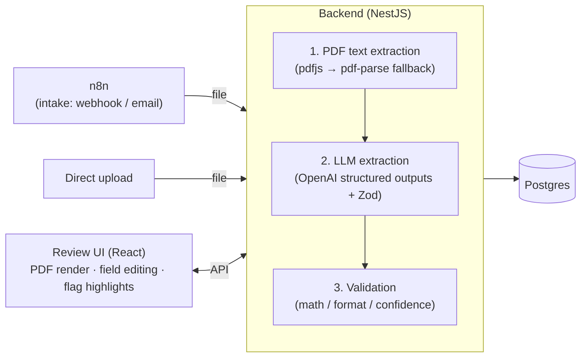

# Document Intake Automation

An invoice-processing pipeline that extracts structured data from PDFs, validates it, and routes low-confidence or inconsistent results to a human review queue. Clean documents complete automatically; only the doubtful ones reach a person.

Built to demonstrate reliable document automation — the emphasis is on the accuracy and trust layer (confidence scoring, validation, human-in-the-loop review), not just wiring an LLM to a PDF parser.

---

## Architecture



### Job lifecycle (state machine)

Every document is a **job** that moves through explicit states. Transitions are validated by a single gatekeeper function — nothing sets status directly.

```text
received → processing → done                    (clean, auto-completed)
                      → needs_review → done      (flagged, human-corrected)
received / processing → dead_letter              (unprocessable, with reason)
```

### Components

| Service     | Stack                   | Role                                       |
|-------------|-------------------------|--------------------------------------------|
| `backend`   | NestJS + TypeORM        | Extraction, validation, job state machine  |
| `review-ui` | React + Vite + Tailwind | Human review: PDF render, edit, approve    |
| `postgres`  | PostgreSQL 16           | Job + extraction storage                   |
| `n8n`       | n8n                     | Intake trigger (webhook / email → backend) |

---

## How it works

1. **Intake** — a document arrives via n8n (webhook or email) or a direct upload, and is stored. A job is created in `received`.
2. **Extraction** — the PDF text is pulled (pdf.js, with pdf-parse as a fallback), then passed to OpenAI with a Zod-enforced schema. Each field comes back with a **value**, a **confidence score**, and a **source reference** (the exact text and page it came from).
3. **Validation** — independent checks run over the result:
   - **Math** — line items sum to subtotal; subtotal + tax equals total; quantity × unit price equals line amount.
   - **Format** — dates parse, amounts are valid non-negative numbers, invoice number is present.
   - **Confidence** — any field below the threshold is flagged.
4. **Routing** — any flag sends the job to `needs_review`; a clean pass goes to `done`.
5. **Review** — flagged jobs appear in the review UI. The reviewer sees the original PDF with flagged fields highlighted on the page, corrects them, and approves. Corrected fields are marked with `confidence: 1.0` and a `corrected` flag for provenance.

---

## Running it

The entire stack runs with one command via Docker Compose.

### Prerequisites

- Docker + Docker Compose
- An OpenAI API key

### Setup

```bash
# 1. Configure environment
cp .env.example .env
# edit .env and set OPENAI_API_KEY

# 2. Build and start everything
docker compose up --build
```

This brings up four services:

| Service     | URL                   |
|-------------|-----------------------|
| Backend API | http://localhost:3000 |
| Review UI   | http://localhost:5173 |
| n8n         | http://localhost:5678 |
| Postgres    | localhost:5432        |

### Try it

Upload an invoice directly:

```bash
curl -X POST http://localhost:3000/jobs/upload -F "file=@your-invoice.pdf"
```

Or open the upload page at http://localhost:5173/upload.html and drop a PDF. A flagged document appears in the review queue at http://localhost:5173.

---

## Configuration

Set in `.env`:

| Variable                 | Default             | Description                                   |
|--------------------------|---------------------|-----------------------------------------------|
| `OPENAI_API_KEY`         | —                   | Required.                                     |
| `OPENAI_MODEL`           | `gpt-4o-2024-08-06` | Must support structured outputs.              |
| `CONFIDENCE_THRESHOLD`   | `0.7`               | Fields below this are flagged for review.     |
| `MONEY_TOLERANCE`        | `0.01`              | Allowed rounding slack in math checks.        |
| `EXTRACTION_MAX_RETRIES` | `3`                 | Retries on transient OpenAI errors (backoff). |

---

## Reliability

- **Retry with backoff** — transient OpenAI errors (rate limits, 5xx, network) retry with exponential backoff; permanent errors (schema refusals) fail fast.
- **Parser fallback** — pdf.js is primary; pdf-parse is a fallback. A job only fails parsing if both cannot read the file.
- **Scan detection** — image-only PDFs (no extractable text) are rejected with a clear reason rather than sent to the LLM as noise. (OCR is not yet supported.)
- **Dead-letter lane** — unprocessable jobs land in `dead_letter` with the failure reason recorded, never silently lost.

---

## API

| Method | Endpoint             | Description                         |
|--------|----------------------|-------------------------------------|
| POST   | `/jobs`              | Create a job from a stored file     |
| POST   | `/jobs/upload`       | Upload a PDF and process it         |
| GET    | `/jobs`              | List all jobs                       |
| GET    | `/jobs/review-queue` | Jobs awaiting review (FIFO)         |
| GET    | `/jobs/:id`          | Job detail incl. extraction + flags |
| GET    | `/jobs/:id/document` | Stream the original PDF             |
| PATCH  | `/jobs/:id/review`   | Submit corrections and approve      |

---

## Known limitations / roadmap

- **OCR** — scanned / image-only PDFs are detected and rejected, not processed.
- **Async processing** — extraction currently runs synchronously in the request. A queue (BullMQ / Redis) would let intake return immediately and scale throughput.
- **Validation scope** — catches math, format, and confidence issues, but not a confidently-wrong extraction (e.g. picking a PO number as the invoice number). That case is what the human review layer is for.
